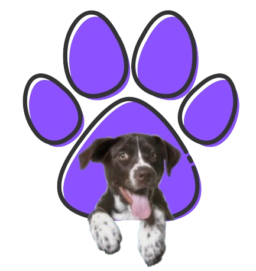
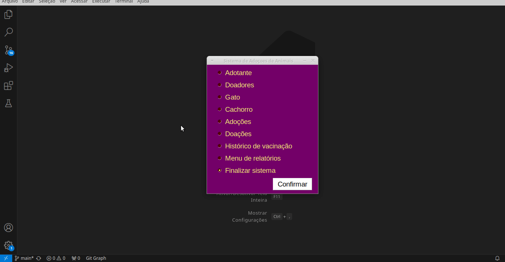
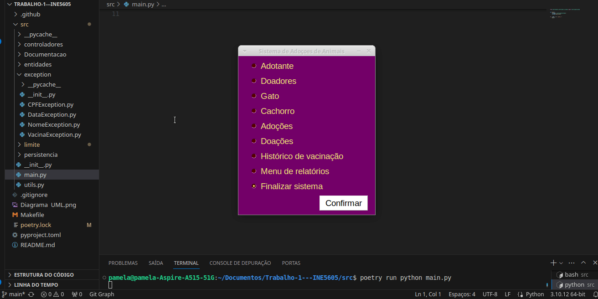
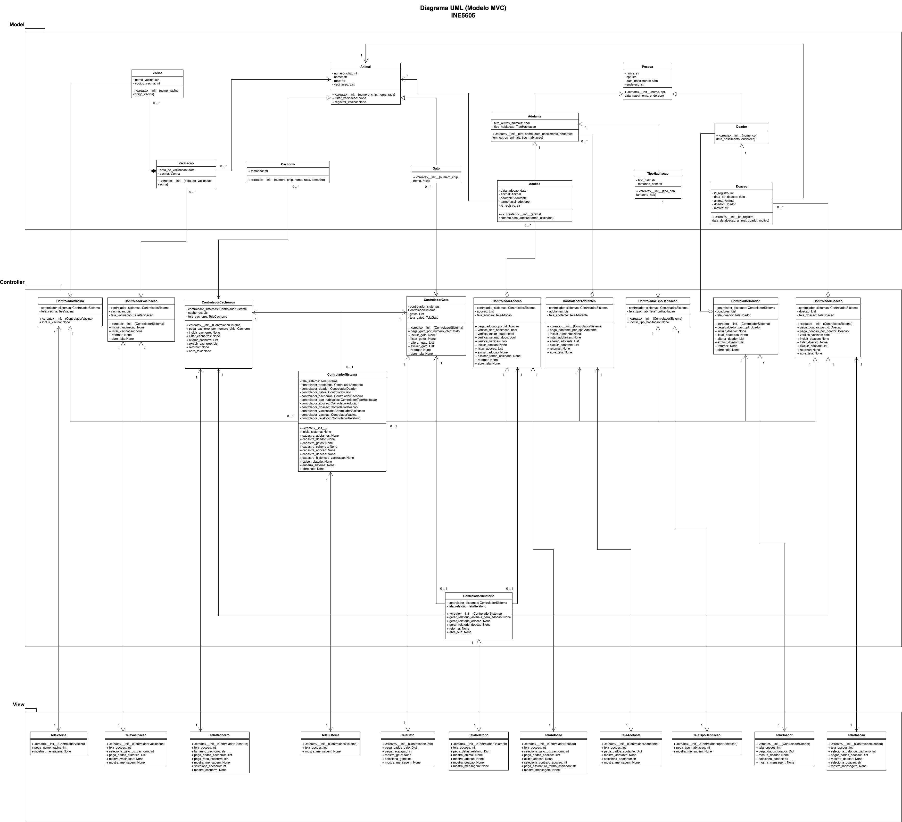

 

 

 ONG ADOTEPET - Adoção de animais

<b>
Este projeto está sendo desenvolvido para a disciplina INE5605 - Desenvolvimento de Sistemas Orientados a Objetos I , ministrada no Universidade Federal de Santa Catarina(UFSC)</b>.

#

**Sistema de Adoções de Animais - ONG (Gatos e Cachorros)**

Desenvolvido como um projeto da disciplina de Programação Orientada a Objetos, este sistema visa facilitar a comunicação entre pessoas que possuem animais para adoção e aquelas que desejam adotar. 

**Regras para quem deseja adotar um animal:**
1. Somente podem adotar animais as pessoas com mais de 18 anos completos.
2. Pessoas que doaram um animal não podem adotar um animal.

3. Somente podem ser adotados os animais que já receberam as vacinas: raiva,
leptospirose e hepatite infecciosa.
4. Cães de porte grande não podem ser adotados por pessoas que moram em apartamento pequeno.

## 🤝 Colaboradores

- <a href="https://github.com/pamelamontteiro">Pamela Oliveira Monteiro</a>
- Thabata John 

## Demonstração da Aplicação 

A aplicação abaixo demonstra seu funcionamento, com a implementação das seguintes funcionalidades:

- **Inclusão, Exclusão, Alteração e Listagem** de registros, incluindo dados de adoção, movimentação de animais, Historico de vacinação , entre outros.

- **Geração de Relatórios** e pesquisas a partir dos registros armazenados, permitindo a extração de informações relevantes sobre os animais e  histórico de adoções.
---

Esse formato apresenta a descrição de forma mais clara e organizada, destacando as funcionalidades de maneira concisa.

    

        
    

  

##  Persistência 

A persistência refere-se ao processo de salvar informações no disco rígido (HD) para garantir que, mesmo após o fechamento do sistema, os dados cadastrados não sejam perdidos.

Estrutura do Sistema: AdotePet

* Possui um classe pai chamada Dao.
* As classes filhas herdam de Dao e representam entidades específicas no sistema. As principais classes filhas são:
    * Gato
    * Cachorro
    * Adotante
    * doador
    * Adoção
    * Doação
    * Vacinação

Exemplo de Persistências: Gato

* No exemplo de demonstração, a classe filha Gato é utilizada para mostrar o funcionamento da persistência. Cada objeto Gato é salvo com um identificador único, que, neste caso, é o número do chip do gato (numero_chip)

    

        
    

## 🛠️ Funcionalidades

### 1. Cadastro de Animais:
*   Cada animal (gato ou cachorro) tem um número de chip, nome, raça e, no caso dos cães, o tamanho (pequeno, médio ou grande).
*   O histórico de vacinação é registrado para cada animal, incluindo a data da vacina e o nome da vacina.

### 2. Cadastro de Adotantes:
O interessado em adotar deve ser cadastrado com CPF, nome, data de nascimento, endereço, tipo de habitação (casa ou apartamento) e se já possui outros animais em casa.

Ao menos um cadastro, contemplando: 
* inclusão
* exclusão
* alteração 
* listagem

### 3. Cadastro de Doador:
O doador de cada animal precisa ser cadastrado com CPF, nome, data de nascimento e endereço.
Os animais são relacionados aos doadores através do registro de doação, que inclui a data da doação, o animal doado, o doador e o motivo da doação.

Ao menos um cadastro, contemplando: 
* inclusão
* exclusão
* alteração 
* listagem

### 4. Processo de Adoção:
Antes de adotar, o perfil do adotante é avaliado.
O adotante escolhe um animal disponível para adoção, que deve ter as vacinas básicas aplicadas e não ter sido adotado.
O adotante assina um termo de responsabilidade comprometendo-se a cuidar do animal.
O sistema registra a data da adoção, o animal adotado, o adotante e a confirmação de assinatura do termo.

Ao menos um cadastro, contemplando: 
* inclusão
* exclusão
* alteração 
* listagem

### 4. Relatorio 
* Relatório de animais disponiveis para adoção:  O sistema mantém uma lista de animais disponíveis para adoção, ou seja, animais doados, com as vacinas básicas aplicadas e que ainda não foram adotados.

*   Relatório de Adoções: O sistema pode gerar um relatório com as adoções realizadas em determinado período.

*   Relatório de Doações: O sistema pode gerar um relatório das doações de animais em determinado período.

### 5. Interface Gráfica 🖥️
* Utiliza a biblioteca PySimpleGui
* Design moderno e intuitivo
* Sistema organizado em abas para fácil navegação

## Modelagem da Aplicação
Esta seção detalha como a aplicação foi modelada para atender às necessidades descritas no desafio proposto. A modelagem foi realizada antes do início do desenvolvimento, com o objetivo de guiar o processo e evitar erros que pudessem comprometer o andamento do projeto.

A modelagem foi feita em UML para compreender melhor o funcionamento das classes e suas heranças.

 

* [Links do Diagrama UML](https://github.com/pamelamontteiro/AdocaoPetsPOO/blob/main/Documentacao/Diagrama_UML_INE5605.jpg)

## 📄 Licença
Este projeto está sob a licença MIT. Veja o arquivo [LICENSE](https://github.com/pamelamontteiro/AdocaoPetsPOO/blob/main/LICENSE) para mais detalhes.

Copyright © 2024 | ONG AdotePet 
